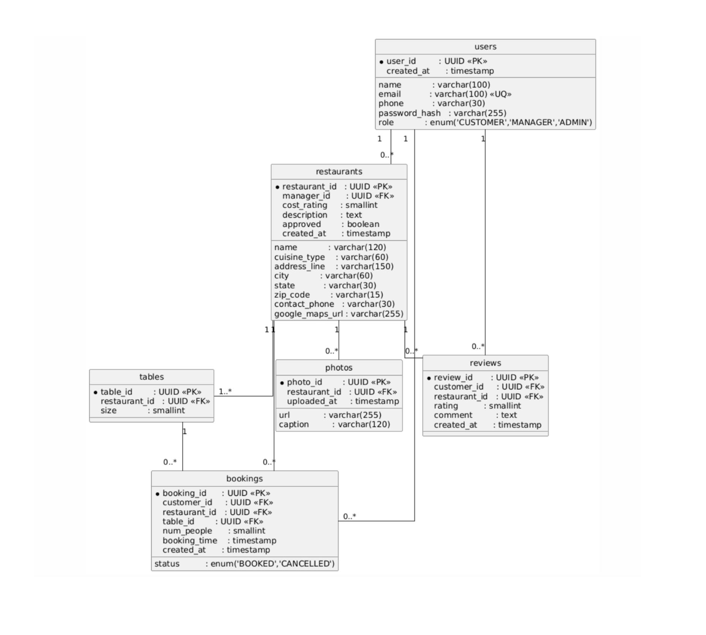

## **BookTable Application**

# 🚀 TEAM NAME : Hackstars  

## 👥 Team Members & Contributions  
- **Dinesh Buruboyina -** -  Established the Node.js backend and MongoDB schema; designed & implemented Business-Owner and search APIs with date/time/party-size filters; integrated authentication, input validation and reviews middleware; deployed the backend to AWS EC2 Auto Scaling + MongoDB Atlas; and prepared the component diagrams 
- **Sravani Linga -** - Connected MongoDB to the backend and created the initial UI; implemented registration, login and profile APIs; integrated Google Maps with ZIP-code lookup; developed dynamic review submission/display features; hooked up the Admin dashboard to live data; polished overall UI/UX; and deployed the frontend to AWS S3 + CloudFront with accompanying deployment diagrams 
- **Tharun Chunchu -** - Drafted the UI wireframes and designed Admin/Review schemas; implemented Review and Admin API endpoints; constructed the Restaurant page UI; designed and integrated the Admin dashboard (duplicate listing detection); added role-based JWT guards and owner booking/cancellation APIs; built analytical dashboard widgets; fixed UI/UX issues; and validated backend deployment
- **SriVenkat Godithi -** - Set up the React frontend with routing and initial components; built the static Home page and restaurant listings; developed Add/Edit/Delete restaurant UI flows with photo uploads and real-time validation; optimized responsive design and cross-browser compatibility; and carried out final UI testing and refinements 

---   

## 🎯 All Diagrams

### System Architecture Diagram


### Component Diagram

 

### Deployment Diagram

  

### UML Diagram

  
 

---

## 💡 Design Decisions

- **Authentication & Security**  
  - **JWT** for stateless, role-based access control (Customer, Manager, Admin)  
  - **bcrypt** for password hashing  
  - HTTPS, CORS policies, and rate limiting on sensitive routes   

- **External Integrations**  
  - **Google Maps Places API** for geolocation & map embeds  
  - **AWS S3** for storing and serving restaurant photos  
  - **Nodemailer** for booking confirmation emails/SMS  

- **Deployment**  
  - **Frontend**: React.js single‐page app, hosted on AWS S3 & CloudFront  
  - **Backend**: Node.js + Express APIs running on an Auto Scaling group of EC2 instances  
  - **Database**: MongoDB Atlas cluster  
  - **File Storage**: AWS S3 for restaurant image uploads   

- **User Experience**  
  - Mobile-first, responsive layouts  
  - Streamlined booking flow (search → select time slot → confirm)  
  - Real-time availability checks to avoid double-bookings
  
- **Design Patterns**
  - **MVC**: Separation of Controllers (Express routes), Services (business logic) and Models (Mongoose schemas)  
  - **Singleton**: Single shared MongoDB connection instance across modules  
  - **Factory**: Service factories to instantiate Mongoose models and helpers  
 
---


## 🚀 Feature Set

### Customer Features
- **Sign Up & Login** (JWT authentication)  
- **Search** By date, time, party size, and location (city/state or ZIP)  
- **Availability Display** See open slots ±30 minutes, with restaurant name, cuisine, price tier, ratings, and today’s booking count  
- **Book & Cancel** tables with email/SMS confirmation  
- **Reviews**: View reviews per restaurant  
- **Profile**: view and update personal details  

### Restaurant Manager Features
- **Add / Edit Listing**: Name, Address, Contact info, Operating hours, Available booking times, Table sizes  
- **Add/Update descriptions & photos** ReRestaurant description, photos
- **Add a new listing** Restaurant profile with basic info Set up initial table configurations  
- **Login as Restaurant Manager** Secure session via JWT tokens   

### Admin Features 
- **Restaurant Approval**: Approve new listings before they go live
- **Reservation Dashboard**: Daily view of incoming bookings, with accept/decline controls  
- **Platform Analytics**: System-wide metrics on bookings, active users, and peak usage   

---

## 🛠️ Project Setup

### Prerequisites

- **Node.js** v16+  
- **npm** v8+  
- **MongoDB** v4+ (or MongoDB Atlas)

### Installation Steps

1. **Clone the repository**  
   ```bash
   git clone https://github.com/gopinathsjsu/team-project-20201-hackstars.git
   ```
2. **Install dependencies**
```bash
npm install
```
3. **To start Backend**
```bash
cd backend
mongod
npm run dev 
```
4. **To start Frontend**
```bash
cd frontend
npm install 
npm start 
```  
---
## 📈 Team Progress

- **Project Journal**: [ProjectJournal-202.pdf](Documentation/ProjectJournal-202.pdf)  
- **XP & Core Values**: [202_XP_CORE_VALUES.pdf](Documentation/202_XP_CORE_VALUES.pdf)  
- **Burndown Chart & Sprints**: [202Burndown Chart.xlsx](Documentation/202Burndown_Chart.xlsx)  
- **UI Wireframes**: [UI_WIREFRAMES.pdf](Documentation/UI_WIREFRAMES.pdf)  
- **Weekly Work Distribution**: [Weekly_Work_Distribution.pdf](Documentation/Weekly_Work_Distribution.pdf)  

---